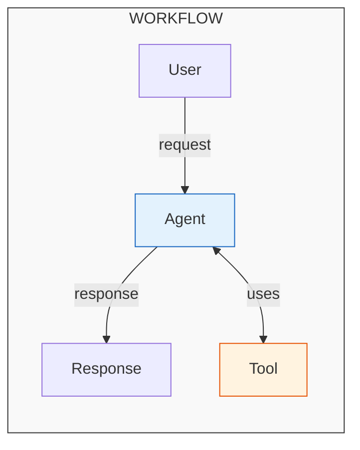
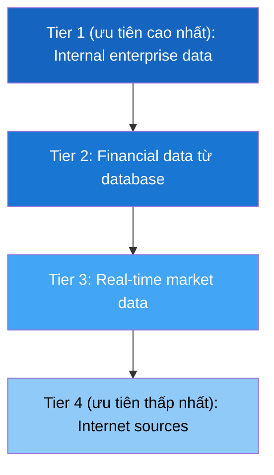
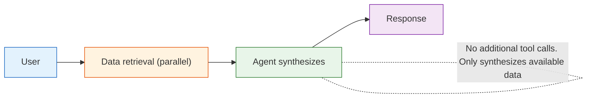
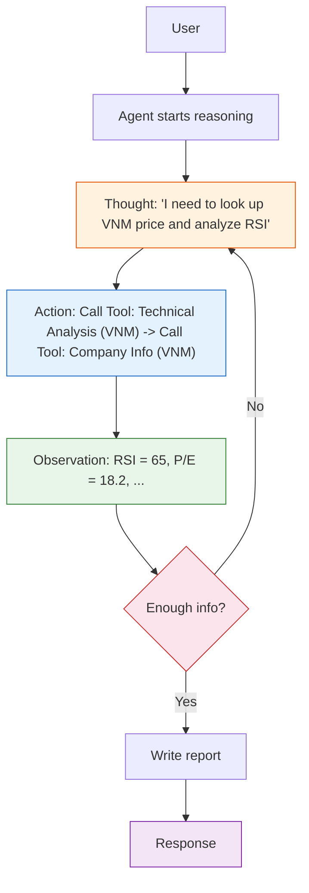

# Kiến trúc AI Agent

Mozyfin cung cấp **AI financial agents** có khả năng lấy dữ liệu real-time, thực hiện phân tích kỹ thuật, đọc báo cáo tài chính và trả lời câu hỏi bằng ngôn ngữ tự nhiên. Hệ thống được xây dựng trên ba khái niệm cốt lõi:

| Khái niệm      | Vai trò                                                    | Ví dụ so sánh                       |
| ------------ | ------------------------------------------------------- | ----------------------------- |
| **Workflow** | Quy trình end-to-end xử lý request của người dùng          | Một production pipeline         |
| **Agent**    | Chuyên gia AI chuyên biệt thực thi tác vụ trong workflow | Công nhân trên pipeline      |
| **Tool**     | Tiện ích Agent dùng để lấy hoặc xử lý dữ liệu      | Thiết bị công nhân vận hành |

---

## Workflows

**Workflow** định nghĩa quy trình đầy đủ từ khi nhận câu hỏi của người dùng đến khi trả về kết quả. Mỗi workflow chỉ định:

- **Agent nào** xử lý request
- **Tools nào** có sẵn cho Agent
- **Chiến lược xử lý**: tra cứu nhanh hoặc phân tích sâu

Mozyfin cung cấp **hai chat workflows chính**:

|                   | Flash Chat                    | Simple Chat                    |
| ----------------- | ----------------------------- | ------------------------------ |
| **Mục đích**       | Tra cứu nhanh, lấy dữ liệu | Phân tích đa nguồn sâu         |
| **Thời gian phản hồi** | < 15 giây                  | 30 – 60 giây                |
| **Reasoning**     | Retrieve → Synthesize         | Sequence Thinking (ReAct)      |
| **Citations**     | Inline, ngắn gọn               | Footnote đánh số             |

---

## Agents

**Agent** là thực thể AI được gán vai trò chuyên môn cụ thể (vd: nhà phân tích tài chính, cố vấn đầu tư). Mỗi Agent có:

- **Role**: Định nghĩa chuyên môn và phong cách phản hồi
- **System Prompt**: Quy tắc và kiến thức nền tảng
- **Tool Set**: Các tools được phép
- **AI Model**: LLM nền tảng

Agents tuân theo **hệ thống phân cấp nguồn dữ liệu 4 tầng**:

<Info>
    **Quy tắc vàng**: Agents **không bao giờ** bịa dữ liệu. Nếu không tìm thấy thông tin, Agent sẽ
    nói rõ không có dữ liệu thay vì đưa ra con số sai.
</Info>

---

## Tools

**Tools** là các module chức năng mà Agents gọi để lấy hoặc xử lý dữ liệu. Mỗi Tool có:

- **Input**: Tham số (Agent xác định dựa trên câu hỏi)
- **Output**: Dữ liệu trả về (bảng, metrics, văn bản)
- **Caching**: Kết quả được cache ngắn hạn để tối ưu performance

---

## Flash Chat

Flash Chat được thiết kế cho câu hỏi cần **câu trả lời nhanh**, tập trung vào việc lấy dữ liệu.

**Quy trình:**

1. Hệ thống nhận câu hỏi, tự động đính kèm timestamp hiện tại
2. **Data retrieval**: Hệ thống phân tích câu hỏi, xác định APIs cần thiết và lấy dữ liệu song song
3. **Synthesis**: Agent nhận toàn bộ dữ liệu đã thu thập và viết response dựa **hoàn toàn** trên dữ liệu đó

### Khi nào dùng Flash Chat

- Tra giá cổ phiếu, tỷ giá, chỉ số thị trường
- Câu hỏi đơn giản có câu trả lời trực tiếp từ dữ liệu
- Khi cần thời gian phản hồi nhanh (< 15 giây)
- Tóm tắt tin thị trường hàng ngày

### Ưu điểm

- **Nhanh**: Phản hồi dưới 10 giây
- **Anti-hallucination**: Agent chỉ dùng dữ liệu đã thu thập, không bịa
- **Streaming**: Kết quả hiển thị dần khi được tạo

### Hạn chế

- Không thể quyết định gọi thêm tools
- Không có phân tích kỹ thuật sâu hoặc SQL queries
- Không có footnote citations

---

## Simple Chat

Simple Chat sử dụng phương pháp **ReAct** (Reasoning + Acting) — Agent reasoning tự chủ, quyết định hành động, quan sát kết quả và lặp lại cho đến khi có đủ thông tin để phản hồi.

### Khi nào dùng Simple Chat

- Phân tích sâu một cổ phiếu hoặc ngành
- Câu hỏi phức tạp cần nhiều nguồn dữ liệu
- SQL queries với data warehouse
- Phân tích kỹ thuật (RSI, MACD, Bollinger Bands...)
- So sánh nhiều mã cổ phiếu
- Khi cần citations nguồn chính xác

### Ưu điểm

- **Sequence Thinking**: Agent reasoning nhiều bước, biết khi nào cần thêm dữ liệu
- **Multi-tool**: Truy cập đầy đủ 7+ loại tool
- **Footnote citations**: Mỗi thông tin đều có nguồn `[1]`, `[2]`...
- **Streaming**: Hiển thị quá trình reasoning (thinking steps) + kết quả real-time

### Hạn chế

- **Chậm hơn**: 30 – 60 giây do nhiều vòng reasoning
- **Tốn tài nguyên hơn**: Nhiều lần gọi LLM và Tool

---

## Chọn Workflow

| Tình huống                                                   | Workflow khuyến nghị |
| ---------------------------------------------------------- | -------------------- |
| "Giá VNM hôm nay bao nhiêu?"                              | Flash Chat           |
| "VN-Index tuần này thế nào?"                           | Flash Chat           |
| "Tỷ giá USD/VND?"                                   | Flash Chat           |
| "Phân tích kỹ thuật VNM"                                | Simple Chat          |
| "So sánh HPG và HSG"                                      | Simple Chat          |
| "Top cổ phiếu theo thanh khoản tuần này"                        | Simple Chat          |
| "Đánh giá sức khỏe tài chính FPT 4 quý gần nhất" | Simple Chat          |
| "Phân tích dòng vốn ngoại tháng này"                    | Simple Chat          |

---

## Tính năng chung

Cả hai workflow đều hỗ trợ:

- **Streaming**: Hiển thị kết quả real-time, không cần chờ xử lý hoàn tất
- **Đa ngôn ngữ**: Phản hồi theo ngôn ngữ người dùng yêu cầu
- **Conversation memory**: Giữ ngữ cảnh cuộc hội thoại trước
- **Anti-hallucination**: Tuân thủ chặt chẽ chỉ phản hồi dựa trên dữ liệu thực
