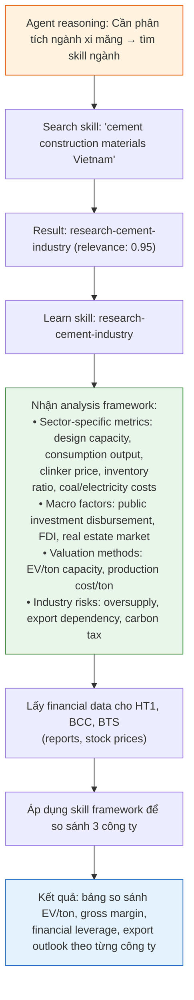

# Skills

**Skills** là các module kiến thức chuyên biệt mà Agents có thể **tìm kiếm và học** tại thời điểm xử lý. Thay vì load toàn bộ kiến thức vào Agent trước, hệ thống cho phép Agents chủ động lấy đúng kiến thức cần thiết cho từng tình huống cụ thể.

<Info>
    **Ví dụ so sánh**: Nếu Agent là nhân viên, thì Skills là **thư viện tài liệu chuyên môn**
    mà nhân viên có thể tham khảo khi cần. Nhân viên không cần ghi nhớ mọi thứ — chỉ
    cần biết cách tìm đúng tài liệu và áp dụng.
</Info>

## Cấu trúc Skill

Mỗi Skill chứa:

| Thành phần    | Mô tả                              | Ví dụ                                                                                              |
| ------------ | ---------------------------------------- | ---------------------------------------------------------------------------------------------------- |
| **ID**       | Định danh dễ đọc                | `research-cement-industry`, `analyze-banking-sector`                                                 |
| **Title**    | Tên mô tả ngắn                   | "Vietnam Cement Industry Research"                                                                   |
| **Category** | Phân loại Skill                     | `industry`, `api`, `analysis`                                                                        |
| **Purpose**  | Mô tả ngắn về chức năng của skill | "Cement industry analysis framework: market structure, sector-specific metrics, influencing factors" |
| **Content**  | Tài liệu chi tiết (Markdown)        | Methods, industry metrics, data sources, best practices                                              |

---

## Cách Agents sử dụng Skills

Agents tương tác với Skills qua quy trình: Search → Learn. Hoàn toàn tự động — Agent quyết định khi nào cần skill dựa trên request của người dùng.

---

## Ví dụ: Agent sử dụng Skill

**Request**: _"Đánh giá triển vọng ngành xi măng Việt Nam và so sánh HT1, BCC, BTS"_

**Không có Skills**, Agent chỉ biết phân tích tài chính chung (P/E, P/B, ROE) — thiếu các metrics theo ngành như EV/ton capacity hay clinker costs. **Có Skills**, Agent có analysis framework sâu, đưa ra đánh giá sát với thực tế ngành hơn.

---

## Vì sao Skills quan trọng

| Không có Skills                           | Có Skills                                                   |
| ---------------------------------------- | ------------------------------------------------------------- |
| Agent dựa vào kiến thức chung của AI   | Agent có tài liệu chuyên biệt, chính xác                 |
| Có thể dùng sai methods hoặc APIs            | Đảm bảo syntax đúng và best practices                     |
| Kiến thức cố định, không cập nhật được       | Cập nhật kiến thức mà không cần thay đổi Agent                   |
| Nhồi nhét mọi kiến thức vào prompt → chậm | Chỉ load kiến thức khi cần → nhẹ và nhanh        |
| Khó mở rộng sang lĩnh vực mới          | Thêm skill mới = mở rộng khả năng Agent ngay lập tức |
