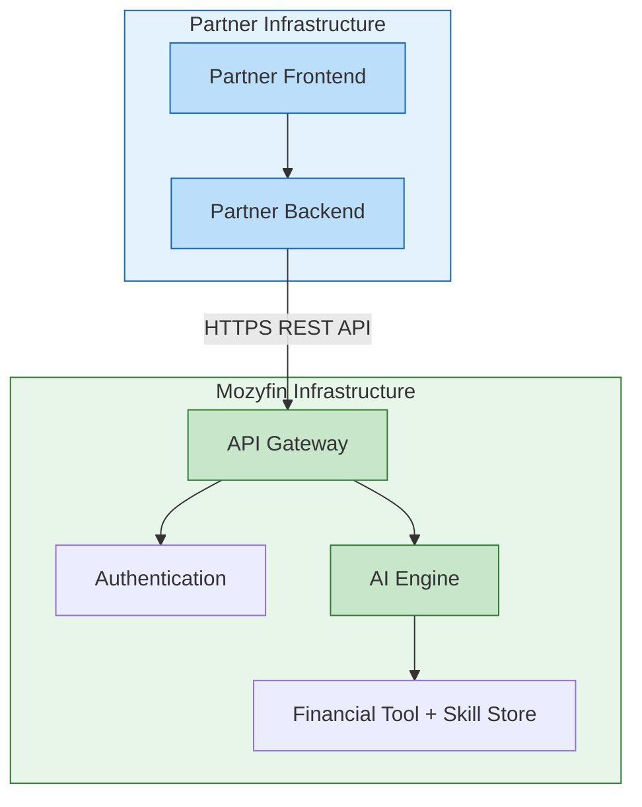

# Tích hợp Đối tác

Mozyfin cung cấp API cho phép **đối tác** (ứng dụng fintech, ngân hàng, công ty chứng khoán, nền tảng đầu tư) nhúng khả năng AI financial agent trực tiếp vào sản phẩm của họ. Người dùng cuối tương tác qua giao diện của đối tác — Mozyfin xử lý toàn bộ AI processing ở phía sau.

## Mô hình tích hợp

**Đối tác không cần**:

- Xây dựng AI models riêng
- Quản lý financial data
- Hiểu nội bộ Agent

**Đối tác chỉ cần**:

- Gọi API với câu hỏi của người dùng
- Hiển thị kết quả trả về trong giao diện

---

## Luồng giao tiếp

Vòng đời đầy đủ khi người dùng cuối đặt câu hỏi trên nền tảng đối tác:

<Steps>
    <Step title="Gửi message">Đối tác gửi câu hỏi của người dùng đến Mozyfin API.</Step>
    <Step title="Nhận xác nhận">
        API trả về ngay lập tức với `message_id` và status `thinking` — không cần chờ Agent hoàn
        thành.
    </Step>
    <Step title="Kiểm tra tiến độ">
        Đối tác poll mỗi 1-2 giây để lấy thinking steps và partial content.
    </Step>
    <Step title="Hiển thị kết quả">
        Khi status chuyển thành `completed`, đối tác hiển thị phân tích đầy đủ kèm citations.
    </Step>
</Steps>

**Đặc điểm chính**:

- **Async**: API nhận request và trả về ngay lập tức
- **Polling**: Đối tác chủ động kiểm tra tiến độ theo chu kỳ (1-2 giây)
- **Partial streaming**: Trong quá trình xử lý, đối tác nhận cả **reasoning process** (Agent đang làm gì) và **partial content** (văn bản đang được viết)

---

## Các bước tích hợp

### Bước 1: Xác thực

Đối tác xác thực qua **API Key**. Mỗi request đến Mozyfin đều có header `X-API-Key`.

```bash
curl -X POST https://partner-api.mozyfin.com/api/v1/chat \
  -H "X-API-Key: mozy_ak_live_your_key_here" \
  -H "Content-Type: application/json"
```

### Bước 2: Tạo Workspace

**Workspace** là container nhóm các chat sessions cùng nhau. Mỗi đối tác nên tạo workspace để tổ chức cuộc hội thoại của người dùng.

```bash
curl -X POST https://partner-api.mozyfin.com/api/v1/workspace \
  -H "X-API-Key: mozy_ak_live_your_key_here" \
  -H "Content-Type: application/json" \
  -d '{"name": "My App Workspace"}'
```

Dùng `workspace_id` trả về khi tạo chat sessions để giữ chúng có tổ chức.

### Bước 3: Tạo Chat Session

Mỗi cuộc hội thoại là một **chat session**. Đối tác chọn **AI mode** phù hợp khi tạo session:

| Mode            | Khi nào dùng                                             | Thời gian phản hồi |
| --------------- | -------------------------------------------------------- | ------------------ |
| `auto`          | **Khuyến nghị.** Tự động chọn giữa flash_chat và simple_chat dựa trên độ phức tạp của câu hỏi | Tùy theo routing   |
| `flash_chat`    | Tra giá, chỉ số, tin tức nhanh                           | < 15 giây          |
| `simple_chat`   | Phân tích kỹ thuật, so sánh cổ phiếu, đánh giá tài chính | 30 – 60 giây       |
| `deep_research` | Nghiên cứu đa Agent sâu và báo cáo                       | 10 – 20 phút       |

```bash
curl -X POST https://partner-api.mozyfin.com/api/v1/chat \
  -H "X-API-Key: mozy_ak_live_your_key_here" \
  -H "Content-Type: application/json" \
  -d '{
    "title": "Market Analysis",
    "mode": "auto",
    "workspace_id": "019542a0-1a2b-3c4d-5e6f-7890abcdef01"
  }'
```

<Info>
    Sử dụng mode `auto` để hệ thống tự động routing giữa `flash_chat` và `simple_chat` dựa trên độ phức tạp của câu hỏi. Đối tác cũng có thể chỉ định mode cụ thể nếu muốn kiểm soát trực tiếp.
</Info>

### Bước 4: Gửi câu hỏi

Đối tác gửi câu hỏi với ngôn ngữ mong muốn. Mozyfin trả về **message ID** ngay lập tức để theo dõi tiến độ.

```bash
curl -X POST https://partner-api.mozyfin.com/api/v1/chat/{chat_id}/message \
  -H "X-API-Key: mozy_ak_live_your_key_here" \
  -H "Content-Type: application/json" \
  -H "Accept-Language: vi" \
  -d '{"content": "Phân tích kỹ thuật cổ phiếu VNM"}'
```

Response chứa `message_id` (`data.id`) dùng để polling.

### Bước 5: Kiểm tra tiến độ (polling)

Đây là phần quan trọng nhất cho trải nghiệm người dùng. Poll theo chu kỳ và hiển thị tiến độ:

| Thông tin           | Mô tả                                             | Gợi ý hiển thị                                 |
| ------------------- | ------------------------------------------------- | ---------------------------------------------- |
| **Status**          | `thinking` / `completed` / `failed` / `cancelled` | Loading indicator                              |
| **Thinking steps**  | Agent đang gọi tool nào, đang phân tích gì        | "Đang tra giá VNM...", "Đang phân tích RSI..." |
| **Partial content** | Phân tích đang được viết, cập nhật mỗi ~500ms     | Streaming text display                         |
| **Citations**       | Danh sách nguồn dữ liệu sử dụng                   | Footnotes hoặc sidebar                         |

```bash
curl https://partner-api.mozyfin.com/api/v1/chat/messages/{message_id} \
  -H "X-API-Key: mozy_ak_live_your_key_here"
```

### Bước 6: Hiển thị kết quả

Khi status chuyển sang `completed`, đối tác nhận kết quả đầy đủ bao gồm nội dung phân tích (Markdown) và danh sách citation.

---

## Tính năng nâng cao

### Instruction Templates

Đối tác có thể đặt **instruction template** cho mỗi chat session để tùy chỉnh hành vi Agent — ví dụ: phong cách đầu tư thận trọng, tập trung rủi ro, hoặc tùy chỉnh cho khách hàng cá nhân vs tổ chức.

```bash
# Tạo template
curl -X POST https://partner-api.mozyfin.com/api/v1/instruction-template \
  -H "X-API-Key: mozy_ak_live_your_key_here" \
  -H "Content-Type: application/json" \
  -d '{
    "instruction": "You are a conservative investment advisor. Always emphasize risks and suggest safe asset allocation. Keep responses concise and data-focused.",
    "type": "custom"
  }'

# Đính kèm vào chat session
curl -X PUT https://partner-api.mozyfin.com/api/v1/chat/{chat_id}/instruction-template \
  -H "X-API-Key: mozy_ak_live_your_key_here" \
  -H "Content-Type: application/json" \
  -d '{"instruction_template_id": "TEMPLATE_ID"}'
```

### Hủy request đang chạy

Đối tác có thể hủy request đang chạy bất cứ lúc nào — hữu ích khi người dùng đổi ý hoặc muốn hỏi điều khác.

```bash
curl -X POST https://partner-api.mozyfin.com/api/v1/chat/messages/{message_id}/stop \
  -H "X-API-Key: mozy_ak_live_your_key_here"
```

---

## Kiến trúc triển khai



- **Protocol**: HTTPS (REST API)
- **Format**: JSON
- **Authentication**: API Key (header `X-API-Key`)
- **Đa ngôn ngữ**: Hỗ trợ qua header `Accept-Language`

**Đối tác cần triển khai**:

1. Backend gọi Mozyfin API (proxy — không gọi trực tiếp từ frontend)
2. Logic polling để theo dõi tiến độ
3. UI hiển thị streaming text + thinking steps
4. Xử lý 4 status: `thinking`, `completed`, `failed`, `cancelled`

---

## Checklist tích hợp

| Bước                   | Ưu tiên     | Mô tả                                  |
| ---------------------- | ----------- | -------------------------------------- |
| Authentication         | Bắt buộc    | API Key, quản lý key                   |
| Tạo chat + gửi message | Bắt buộc    | Luồng chính, chọn AI mode phù hợp      |
| Polling loop           | Bắt buộc    | Chu kỳ 1-2 giây, xử lý 4 status        |
| Streaming text         | Khuyến nghị | Hiển thị partial content, UX tốt hơn   |
| Thinking steps         | Tùy chọn    | Hiển thị quá trình reasoning của Agent |
| Citations              | Khuyến nghị | Tăng niềm tin người dùng               |
| Document upload        | Tùy chọn    | Phân tích kết hợp với tài liệu nội bộ  |
| Instruction template   | Tùy chọn    | Tùy chỉnh persona Agent theo use case  |
| Cancel request         | Tùy chọn    | Cho phép dừng Agent đang chạy          |
